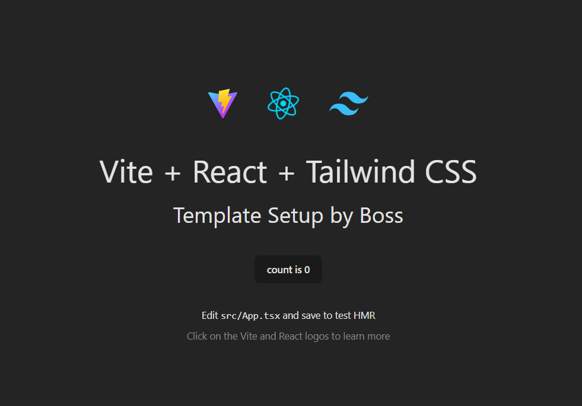

# React + Vite + Tailwind CSS + TypeScript Template ⚡ 



This is a **starter template** for creating modern React applications using:
- ⚡ [Vite](https://vitejs.dev/) (Fast build tool)
- 🎨 [Tailwind CSS](https://tailwindcss.com/) (Utility-first CSS framework)
- 🏷️ [TypeScript](https://www.typescriptlang.org/) (Static typing for JavaScript)

## 📌 Features
✅ Pre-configured **Vite + React + TypeScript**  
✅ Integrated **Tailwind CSS**  
✅ Ready-to-use **file structure**  
✅ Fast and lightweight 

---

## 🛆 Installation

### 1⃣ Clone this repository as your project starter:
```sh
git clone https://github.com/Sahasawat-Boss/react-vite-tailwind-ts-template.git my-project
cd my-project
```

### 2⃣ Remove the Old Git History
If you want to start fresh without the commit history of this template:
```sh
rm -rf .git
git init
git add .
git commit -m "Initial commit"
```
Now, you have a clean repository.

### 3⃣ Install dependencies:
```sh
npm install
```

### 4⃣ Start the development server:
```sh
npm run dev
```

Your app will be running at **http://localhost:5173/** 🎉.

---

## 🎨 Tailwind CSS Configuration
Tailwind is already set up! You can customize it in **`tailwind.config.ts`**:
```ts
export default {
  content: ["./index.html", "./src/**/*.{js,ts,jsx,tsx}"],
  theme: {
    extend: {},
  },
  plugins: [],
};
```
Use Tailwind classes directly in your components:
```tsx
<button className="bg-blue-500 text-white px-4 py-2 rounded-lg">
  Click Me
</button>
```

---

## 🛠 Folder Structure
```
📂 my-project
 ┓ 📂 src
 ┃ ┓ 📂 assets
 ┃ ┓ 📂 components
 ┃ ┓ 📂 pages
 ┃ ┓ 🐜 App.tsx
 ┃ ┓ 🐜 main.tsx
 ┃ ┓ 🐜 index.css
 ┓ 🐜 .gitignore
 ┓ 🐜 package.json
 ┓ 🐜 tailwind.config.ts
 ┓ 🐜 tsconfig.json
 ┓ 🐜 vite.config.ts
```

---

## 🚀 Creating a New Project Using This Template
Instead of cloning manually, you can use this repository as a **GitHub template**:

1. Click **"Use this template"** on GitHub.
2. Create your new repository.
3. Clone the new repo and start coding!

---

## 🔗 Useful Commands

### **Start Development Server**
```sh
npm run dev
```

### **Build for Production**
```sh
npm run build
```

### **Preview the Production Build**
```sh
npm run preview
```

---

## 🤝 Contributing
Feel free to **fork this repository** and improve it! If you make useful changes, consider opening a **pull request**.

---

## License
This project is licensed under the **MIT License**.

---

🔥 **Created by [@Sahasawat-Boss](https://github.com/Sahasawat-Boss)**
